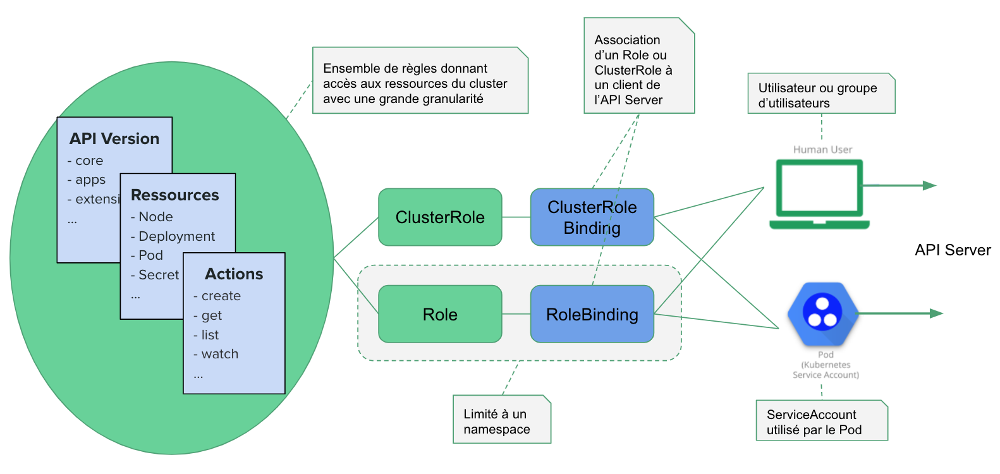

====
RBAC
====

à chaque utilisation de kubectl, c'est une requête à l'API server qui est faite en dessous.

chaque requête passe par plusieurs étapes:
- autentification
- autorisation
- vérifier/ajouter des champs (admission controlers)

Authentication
--------------

Une requête envoyée à l'API server peut provenir:
- d'un utilisateur humain
- d'un process dans un pod du cluser (administration par ex)

La gestion des utilisateurs n'est pas faite dans le cluster, pas de ressources à ce propos.
L'autentification est faite par quelque chose d'extérieur, et son utilisation est gérée par
des plugins d'autentification.

Authentication User
___________________

différents plugins sont utilisables, selon le type d'autentification:

- certificat client
    - certificat signé par l'autorité de certficiation du cluster
    -contient dans le cn (common name) un identifiant utilisation
    - contient dans o (organisation) les infos du groupe éventuel
- un bearer token
    - intégré dans le header "Authentification" de la requête http
    - fichier csv contenant id,token,identifiant,groupes
    - dans la version actuelle, les tokens n'expirent jamais
- HTTP Basic Authentication
    - on encore la chaine logine:password en base64
    - on la positionne dans le header du token d'utilisation
    - stocké dans un csv également

authentication d'un Pod
_______________________

Pour un processus interne, on lui donne une identité via un ServiceAccount.
En lançant un pod, on peut lui donner un ServiceAccount à utiliser.

Certificat client x509
______________________

l'utilisateur crée d'abord une clé privée/publique, puis la génération d'une csr

.. code-block:: shell

    # création d'une clé privée et d'une CSR
    openssl genrsa -out jvince.key 2048
    openssl req -new \
        -subj "/CN=jvince/O=development" \
        -key jvince.key
        -out jvince.csr

L'administrateur génère un certificateSigningRequest, à partir du csr encodé en base64

.. code-block:: yaml

    apiVersion: certificate.k8s.io/v1beta1
    kind: CertificateSigningRequest
    metadata:
        name: mycsr
    spec:
        groups:
        - system:authenticated
        request: $BASE64_CSR
        usages:
        - digital signature
        - key encipherment
        - server auth
        - client auth

Puis l'administrateur approuve le certificat

.. code-block::

    kubectl certificate approve

L'utilisateur peut alors se connecter

.. code-block::

    # ajout  d'une entrée user dans la configuration
    kubectl config set-credentials jvince \
        --client-key=jvince.key \
        --client-certificate=jvince.crt

    # création d'un nouveau contexte
    kubectl config set-context jvince-ctx \
        --cluster=CLUSTERNAME \
        --user=jvince

    # liste des users dans le context jvince-ctx
    kubectl get pods --context jvince-ctx

authentication : ServiceAccount
_______________________________

.. code-block:: bash

    # listing des services accounts
    kubectl get sa --all-namespaces

    # consultation du default
    kubectl get sa/default -o yaml

    # consultation de son secret
    kubectl get secret default-token-jfp6k -o yaml

    #récupération du token, decodage en base64, on obtient un jwt
    kubectl get secret default-token-jfp6k -o jsonpath='{data.token}' | base64 -d

Pour illustrer :

.. code-block:: yaml

    # serviceAccount "monitoring.yaml"
    apiVersion: v1
    kind: ServiceAccount
    metadata:
        name: monitoring

.. code-block:: yaml

    # création d'un Pod "pod.yaml"
    apiVersion: v1
    kind: Pod
    metadata:
        name: monitoring
    spec:
        containers:
        - image: nginx
          name: mon
        serviceAccountName: monitoring

.. code-block:: bash

    kubectl apply -f monitoring.yaml

    kubectl apply -f pod.yaml

Autorisation
------------

K8S implémente un process de RBAC, ensemble de règles qui s'imposent aux utilisateurs et serviceAccount
qui permet l'accès aux ressources de manière granulaires.

Cela s'effectue en utilisant différentes ressources :

- les roles: qui permettent de définir des règles dans un namespace
- les cluster roles : permettent de définir des règles dans le cluster entier
- les role binding et cluster role binding : permettent d'associer roles & clusterRoles aux utilisateur et serviceAccount

Au sein d'un Role/ClusterRole, on défini un ensemble de règle qui permettent
- une granularité très fine des actions autorisées,
- sur quelles ressources,
- sur quelles versions

Pour pouvoir associer un role/clusterRole à utilisateur/SA, on utilise un roleBinding/roleClusterBinding.

Role & RoleBinding
''''''''''''''''''

C'est une ressource K8s

.. code-block:: yaml

    # un role
    apiVersion: rbac.authorization.k8s.io/v1
    kind: Role
    metadata:
        # un role est toujours limité à un namespace
        namespace: development
        name: dev-pod-reader
    rules:
    # lister et visualiser les pods qui sont dans le ns
    - apiGroups: [""]
      resources: ["Pods"]
      verbs: ["get", "list"]

.. code-block:: yaml

    # roleBinding
    apiVersion: rbac.authorization.k8s.io/v1
    kind: RoleBinding
    metadata:
        # un role est toujours limité à un namespace
        namespace: development
        name: dev-pod-reader
    subjects:
    # plusieurs sujets possibles, User ou ServiceAccount
    - kind: User
      name: jvince
      apiGroup: rbac.authorization.k8s.io
    # fait le lien avec le role
    roleRef:
        kind: Role
        name: dev-pod-reader
        apiGroup: rbac.authorization.k8s.io

ClusterRole & ClusterRoleBinding
''''''''''''''''''''''''''''''''

.. code-block:: yaml

    # un role
    apiVersion: rbac.authorization.k8s.io/v1
    kind: ClusterRole
    metadata:
        # on ne précise pas de ns
        name: secret-reader
    rules:
    # lister et visualiser les secrets qui sont dans le cluster
    - apiGroups: [""]
      resources: ["secret"]
      verbs: ["get", "list"]

.. code-block:: yaml

    # ClusterRoleBinding
    apiVersion: rbac.authorization.k8s.io/v1
    kind: ClusterRoleBinding
    metadata:
        name: dev-pod-reader
    subjects:
    # plusieurs sujets possibles, User ou ServiceAccount
    - kind: ServiceAccount
      name: manager
      apiGroup: rbac.authorization.k8s.io
    # fait le lien avec le role
    roleRef:
        kind: ClusterRole
        name: secret-reader
        apiGroup: rbac.authorization.k8s.io